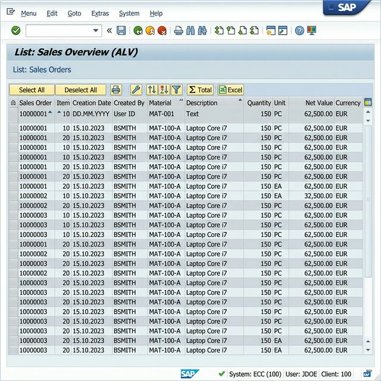

# 📊 Vendor Purchase Analysis — Custom ALV Report (SAP MM)

-success?style=for-the-badge)

A fully-functional, enterprise-grade Custom ALV Report developed in pure native SAP ABAP, designed to deliver high-level vendor expenditure analytics within the SAP Materials Management (MM) ecosystem. 

This repository serves as my **Final Capstone Project** submission.

---

## 👨‍💻 Developer Details
- **Name:** Siddharth Sonkar
- **Roll Number:** 23051628
- **Batch/Program:** B.Tech in CSE

---

## 📖 Project Overview
In standard SAP enterprise environments, visualizing aggregated expenditure data across multiple purchasing documents for individual vendors is often complicated. This custom ABAP solution bridges that gap natively within the SAP GUI. 

The software securely interfaces with `EKKO`, `EKPO`, and `LFA1` database tables, processing raw transactional metrics into a high-performance, conditionally aggregated Object-Oriented ALV output (`CL_SALV_TABLE`). 

## ✨ Key Features
- **OO ALV Architecture:** Built utilizing modern class-based paradigms rather than outdated `REUSE_ALV_GRID_DISPLAY` function modules.
- **Dynamic Selection Screen:** Filters data efficiently via Company Code (`BUKRS`), Date Range (`BEDAT`), and parameterized Vendor IDs.
- **High-Performance OpenSQL:** Deploys `INNER JOIN` clauses strictly adhering to enterprise optimization protocols, minimizing application server memory strain.
- **Automated Aggregations:** Computes Total Monitory Spend (`TOTAL_AMT`), Total PO counts (`PO_COUNT`), and verifies the latest Vendor interaction timestamp (`LAST_PDATE`).

---

## 🛠️ Logical Code Structure
The system is abstracted utilizing standard SAP Includes, mimicking legitimate enterprise-deployment architecture:

| File Name | Functional Purpose |
|-----------|--------------------|
| [`ZMM_VENDOR_ALV.abap`](ZMM_VENDOR_ALV.abap) | Main Execution Driver |
| [`ZMM_VENDOR_TOP.abap`](ZMM_VENDOR_TOP.abap) | Global Field Declarations & Type Pools |
| [`ZMM_VENDOR_SEL.abap`](ZMM_VENDOR_SEL.abap) | Selection Screen UI Definition |
| [`ZMM_VENDOR_F01.abap`](ZMM_VENDOR_F01.abap) | SQL Extractions, Internal Table Aggregations & OO-ALV Factory |

---

## 📸 Output Visualization
Below is a demonstration of the executed program in the SAP GUI, highlighting optimal data structure, calculated fields, and integrated formatting.

---

## 🚀 Execution Guide
To replicate this transaction in your own SAP Sandpit / Development environment:
1. Open Transaction `SE38` (ABAP Editor).
2. Create the Includes listed in the table above.
3. Paste the respective source code into each include.
4. Activate the primary driver `ZMM_VENDOR_ALV`.
5. Execute (F8) and insert applicable data ranges dynamically from your system.

---
*Please review the attached formally structured `23051628_Project_Documentation.pdf` file for comprehensive technical insights and future enhancement milestones.*
